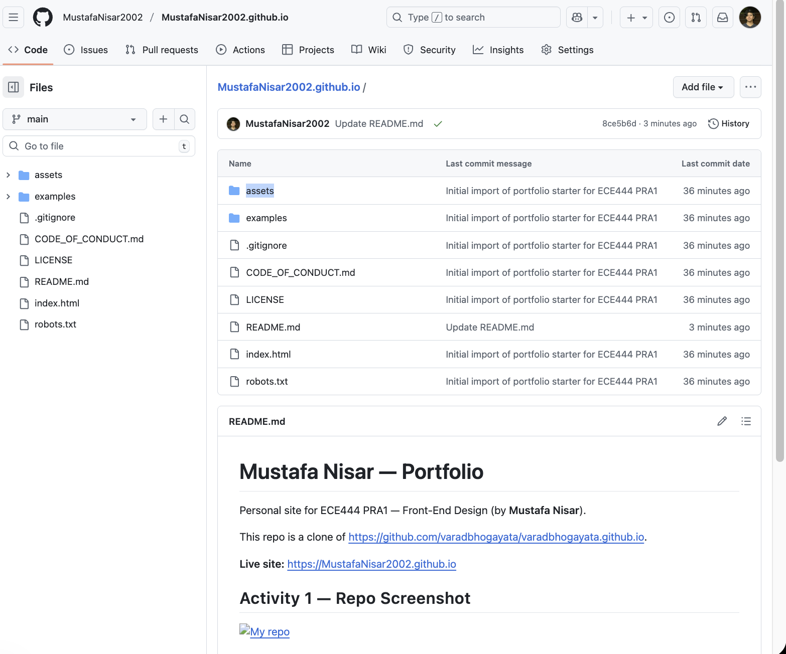
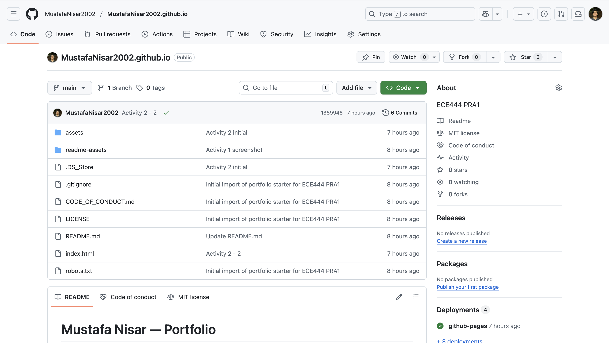
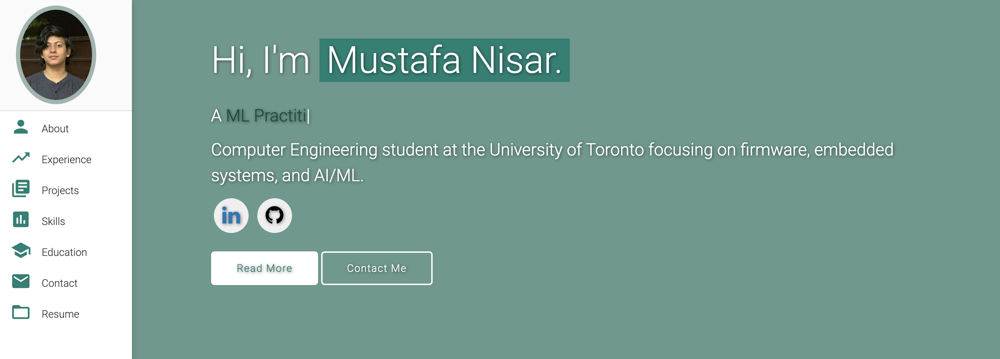
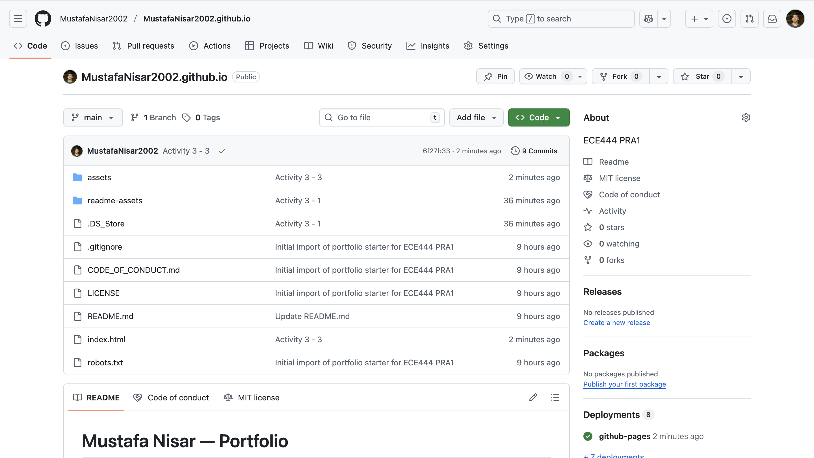
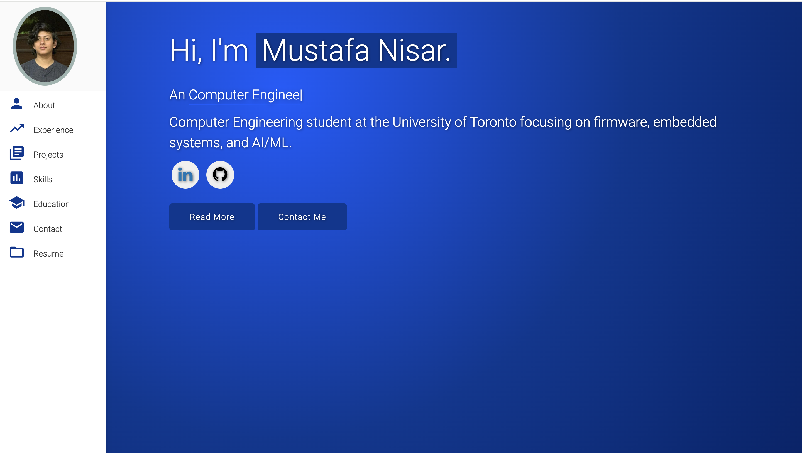
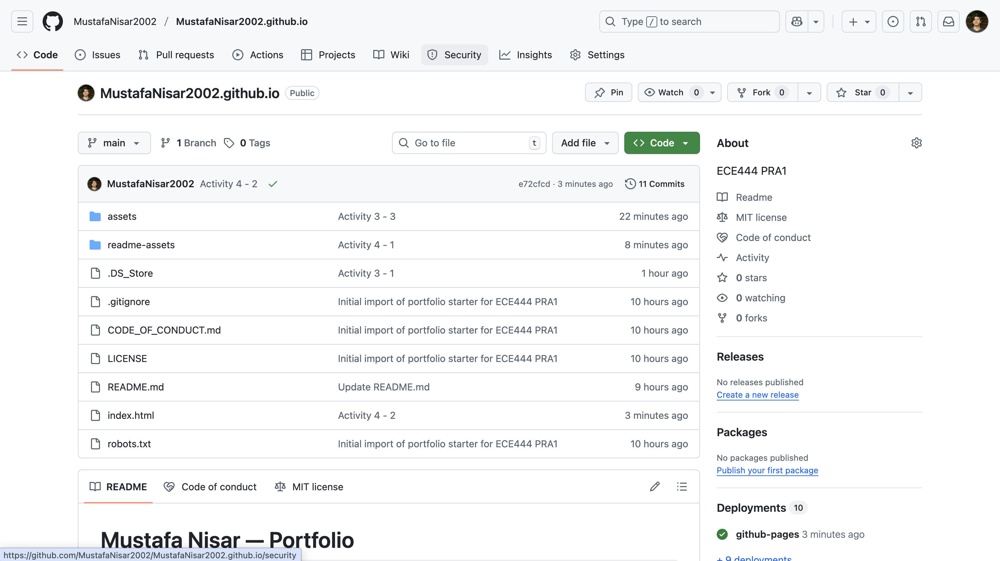
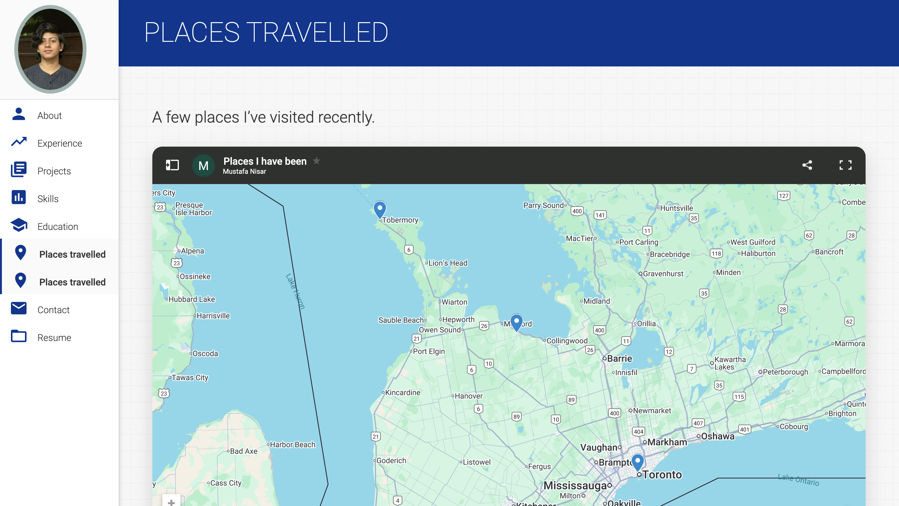
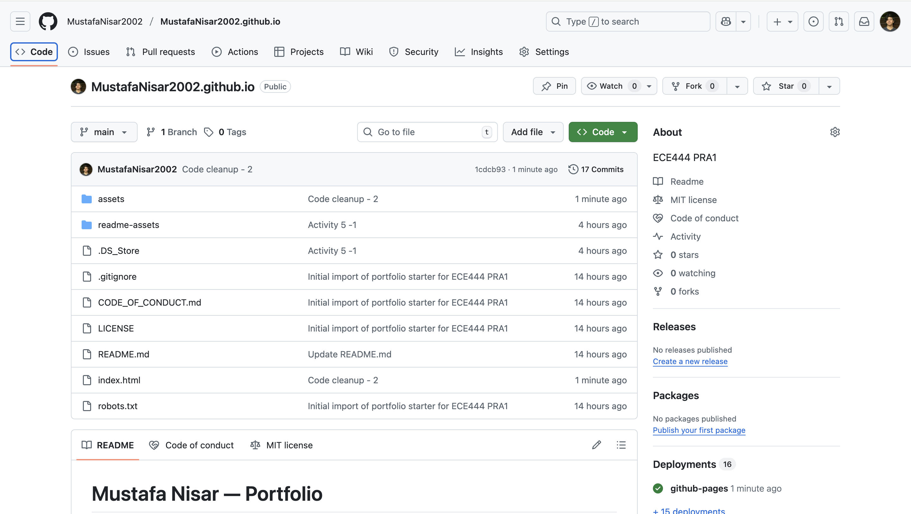
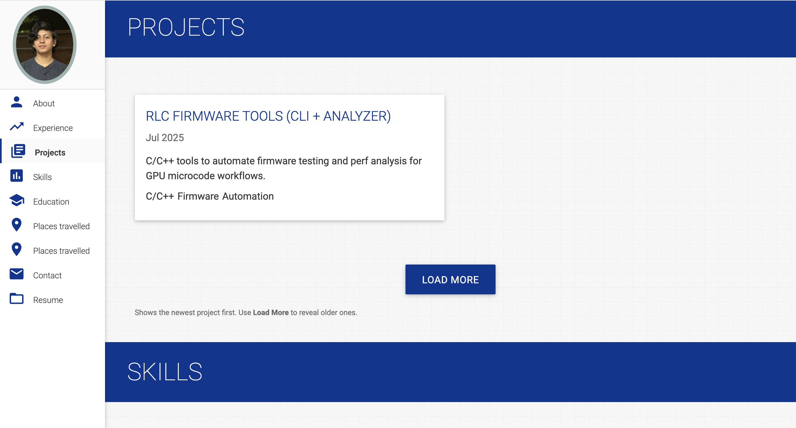

# Mustafa Nisar — Portfolio

Personal site for ECE444 PRA1 — Front-End Design (by **Mustafa Nisar**).

This repo is a clone of https://github.com/varadbhogayata/varadbhogayata.github.io.

**Live site:** https://MustafaNisar2002.github.io

## Activity 1 — Repo Screenshot

## Activity 2 — Repo Screenshot

## Activity 2 — Website Screenshot

## Activity 3 — Repo Screenshot

## Activity 3 — Website Screenshot

## Activity 4 — Repo Screenshot

## Activity 4 — Website Screenshot

## Activity 5 — Repo Screenshot

## Activity 5 — Website Screenshot

## About
A simple personal portfolio website hosted on GitHub Pages.

## How this was set up
- Cloned the starter template locally
- Reinitialized Git and pushed to `MustafaNisar2002.github.io`
- Will customize content, color theme, and add sections in later activities

## Credit
Starter template by Varad Bhogayata — see original repo above.
